<p>
  
<a href='https://coveralls.io/github/connorferster/handcalcs?branch=master'></a>
  
  
  
  
  
</p>
<p align="center">
  <br>
  Covert art by <a href = "https://www.instagram.com/joshuahoibergtattoos/">Joshua Hoiberg</a>
</p>

<h1 align = "center">handcalcs:<br>Python calculations in Jupyter,<br>as though you wrote them by hand.</h1>

`handcalcs` is a library to render Python calculation code automatically in Latex, but in a manner that mimics how one might format their calculation if it were written with a pencil:  write the symbolic formula, **followed by numeric substitutions**, and then the result.

Because `handcalcs` shows the numeric substitution, the calculations become significantly easier to check and verify by hand.


## Contents

* [Basic Demo](https://github.com/connorferster/handcalcs#basic-demo)
* [Installation](https://github.com/connorferster/handcalcs#installing)
* [Basic Usage](https://github.com/connorferster/handcalcs#basic-usage-1-as-a-jupyter-cell-magic-render)
* [Enhanced Usage](https://github.com/connorferster/handcalcs#basic-usage-2-as-a-decorator-on-your-functions-handcalc)
* [Features](https://github.com/connorferster/handcalcs#features)
* [PDF Printing in Jupyter](https://github.com/connorferster/handcalcs#pdf-printing-in-jupyter)
* [Expected Behaviours](https://github.com/connorferster/handcalcs#expected-behaviours)
* [Gotchas and Disclaimer](https://github.com/connorferster/handcalcs#gotchas)
* [YouTube Tutorials](https://github.com/connorferster/handcalcs#youtube-tutorials)
* [Applications and Compatibility with Other Libraries (wiki)](https://github.com/connorferster/handcalcs/wiki)


## Basic Demo

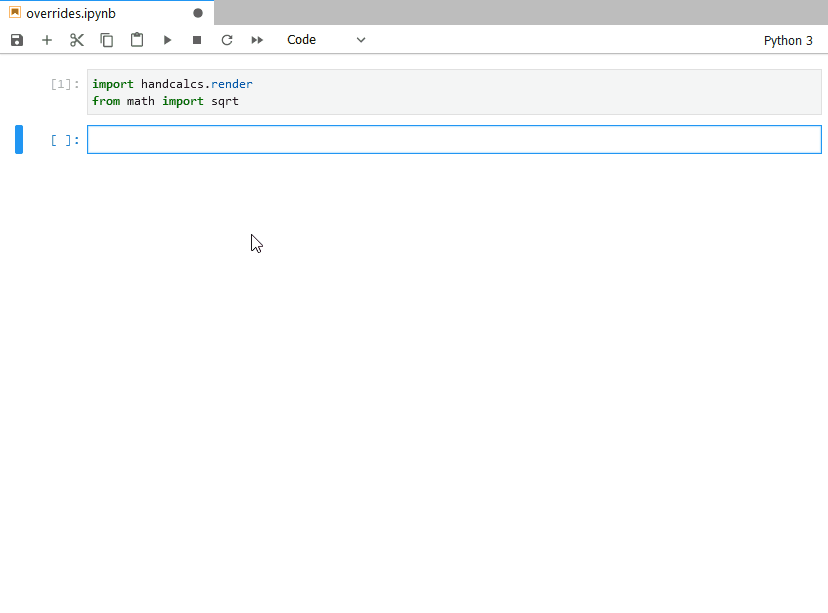


## Installing

You can install using pip:

`pip install handcalcs`

## Basic Usage 1: As a Jupyter cell magic (`%%render`)
`handcalcs` is intended to be used with either Jupyter Notebook or Jupyter Lab as a _cell magic_.

First, import the module and run the cell:

```python
import handcalcs.render
```

> Note: This will import both `%%tex` and `%%render` magics in the Jupyter Notebook. 

Then, in any cell that you want to render with `handcalcs`, just use the render cell magic at the top of your cell:

```python
%%render
```

For example:

```python
%%render
a = 2
b = 3
c = 2*a + b/3
```

**That is it!**

Once rendered, you can then export your notebook as a PDF, provided you have a Latex environment installed on your system. If you are new to working with Latex and would like to install it on your system so you can use this functionality, please see the section [Installing Tex](https://github.com/connorferster/handcalcs/wiki), in the wiki.

You can also use the `%%tex` command to convert any Python code snippet into a valid LaTex. For Example:

First import `handcalcs`. We are also importing a few properties/functions from __math__ package for the 
example below.

```python
import handcalcs.render
from math import sqrt, pi
```

Now, you can use the `%%tex` magic!

```python
%%tex
a = 2 / 3 * sqrt(pi)
```

This will produce a LaTeX output as follows.

```tex
\[
\begin{aligned}
a &= \frac{ 2 }{ 3 } \cdot \sqrt{ \pi } = \frac{ 2 }{ 3 } \cdot \sqrt{ 3.142 } &= 1.182
\end{aligned}
\]
```
## Basic Usage 2: As a decorator on your functions, `@handcalc()`

_Shout-out to @eriknw for developing [innerscope](https://github.com/eriknw/innerscope) and proactively integrating it into `handcalcs`. Thank you!_


Start by importing the `@handcalc()` decorator:

```python
from handcalcs.decorator import handcalc
```

```python
@handcalc([override: str = "", precision: int = 3, left: str = "", right: str = "", jupyter_display: bool = False])
```

Returns a tuple consisting of `(latex_code: str, locals: dict)`, where `locals` is a dictionary of all variables in the scope of the function namespace.

* `override` is a str representing one of the acceptable override tags (see below)
* `precision` is an int to alter the of decimal precision displayed
* `left` and `right` are strings that can precede and follow the encoded Latex string, such as `\\[` and `\\]` or `$` and `$`
* `jupyter_display`, when True, will return only the `locals` dictionary and instead will display the encoded Latex string rendering with `display(Latex(latex_code))` from `IPython.display`. Will return an error if not used within 

In your decorated function, everything between `def my_calc(...)` and a return statement (if any) is now like the code in a Jupyter cell, except it's a standard Python function.

Used in this way, you can use `@handcalc()` to dynamically generate Latex code for display in Jupyter and non-Jupypter Python environments (e.g. streamlit). 

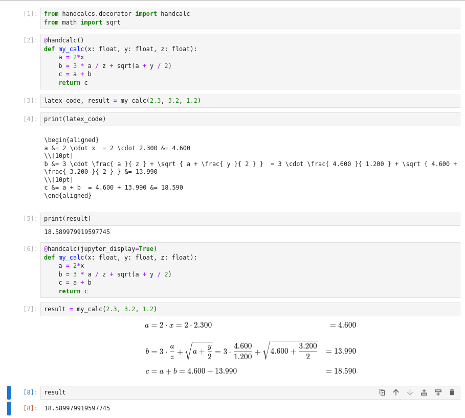


## Override tags

`handcalcs` makes certain assumptions about how you would like your calculation formatted and does not allow for a great deal of customization in this regard. However, there are currently **four** customizations you can make using `# override tags` as an argument after the `%%render` cell magic. Additionally, you can also specify the number of decimals of precision to display. You can only use __one__ override tag per cell **but** you can combine an override tag with a precision setting.

**Override tags can be used with both the Jupyter cell magic and the function decorator**. To use a override tag with the decorator, you just supply it as an argument, e.g. `@handcalc(override='params', precision=2)`

I will compare a basic rendering of the quadratic formula (below) with the change achieved with each override tag.

### Basic rendering:
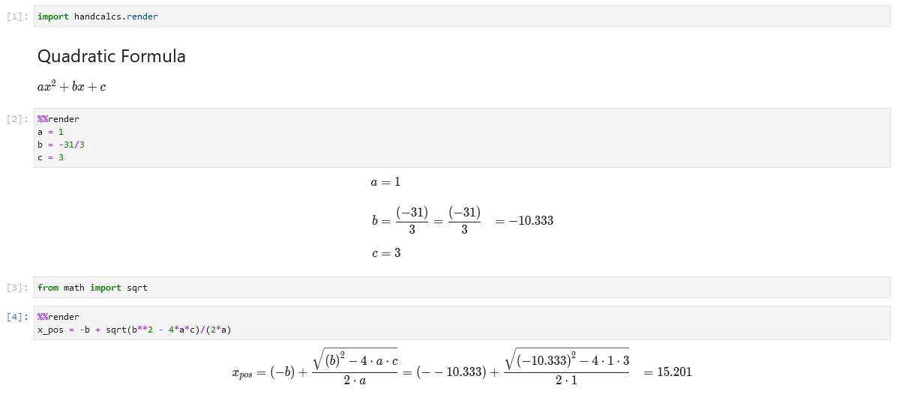


___

### `params`: 
`handcalcs` renders lines of code vertically, one after the other. However, when you are assigning variables, or displaying resulting variables, you may not want to waste all of that vertical space. 

Using the `params` override tag, your list of parameters will instead render in three columns, thereby saving vertical space. Additionally, onsly the result will be shown, no calculations.

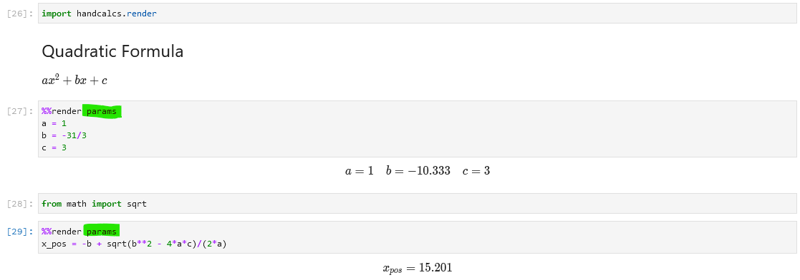

___

### Adjust precision:

The number of decimal places in a cell can be adjusted by providing an integer after `%%render` to indicate the decimal precision to be displayed. Can be combined with another override tag.

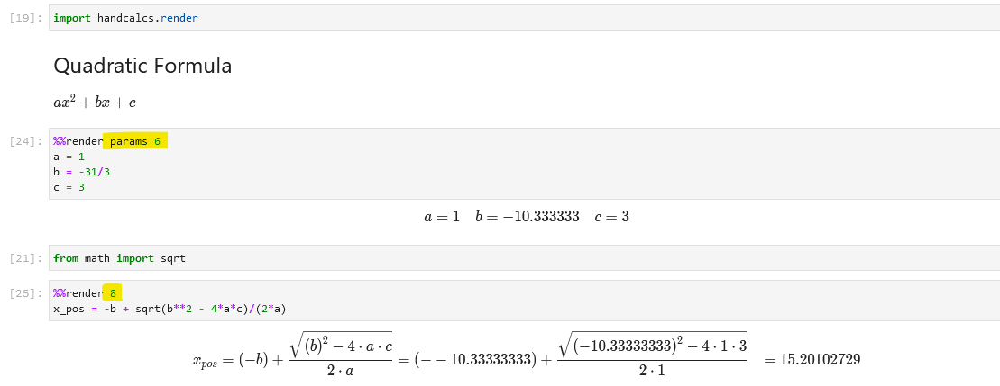

___
### `long` and `short`: 
To save vertical space, `handcalcs` _attempts_ to figure out how long your calculation is and, if it is short enough, renders it out fully on one line.

If `handcalcs`'s internal test deems the calculation as being too long to fit onto one line, it breaks it out into multiple lines. 

Use the `# long` or `# short` override tags to override the length check and display the calculation in the "Long" format or the "Short" format for all calculations in the cell. e.g.

#### `long: Spans multiple lines as though you had a long equation`

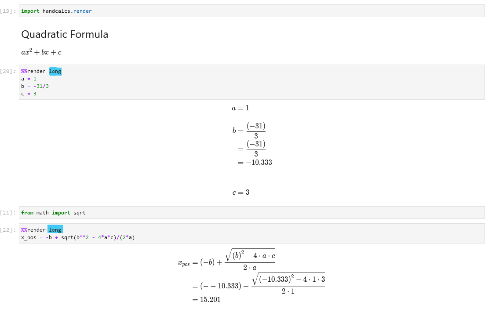


#### `short: Forced to a single line as though you had a short equation`
```python
    # Format for "short" calculations (can fit on one line):
    c = 2*a + b/3 = 2*(2) + (3)/3 = 5

    # Format for "long" calculations (requires multi-line format)
    c = 2*a + b/3
      = 2*(2) + (3)/3
      = 5
```
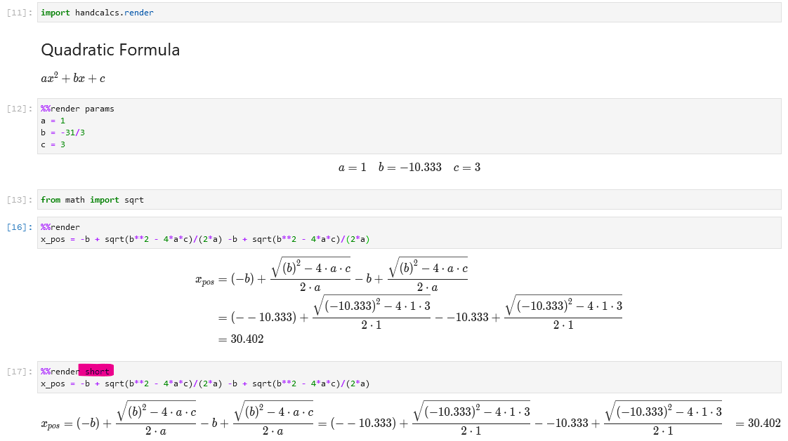

___
### `symbolic`
The primary purpose of `handcalcs` is to render the full calculation with the numeric substitution. This allows for easy traceability and verification of the calculation. 

However, there may be instances when it is preferred to simply display calculations symbolically. For example, you can use the `symbolic` tag to use `handcalcs` as a fast way to render Latex equations symbolically.

Alternatively, you may prefer to render out all of input parameters in one cell, your formulae symbolically in the following cell, and then all the final values in the last cell, skipping the numeric substitution process entirely.

Keep in mind that even if you use the `symbolic` tag with your calculations, you still need to declare those variables (by assigning values to them) ahead of time in order for your calculation to be valid Python.

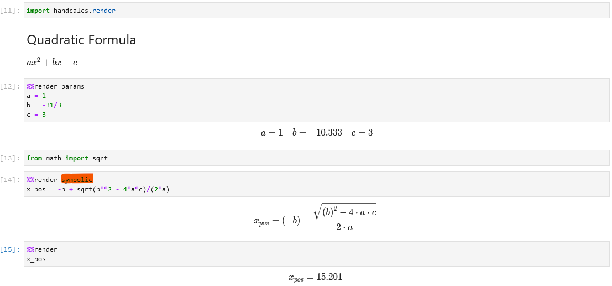

---

### `sympy`

This is intended to be used only with `sympy` loaded. Sympy allows for symbolic manipulation, solving, and integration of algebraic expressions. Sympy will render its own objects in Latex without handcalcs. 

If you are manipulating a sympy expression or sympy equation for the purpose of calculation, you can use `handcalcs` to handle the substitution and calculation of your resulting expression. <br>

_Note: Re-assigning your symbolic variables to numbers will clobber them as sympy variables. However, you are done with these now, right? So, it's no problem. If you need to work symbolically again, just re-run your notebook cells from the top._

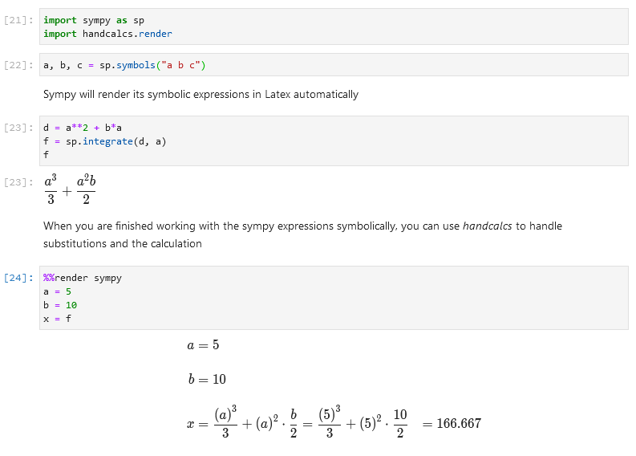

---

## Units Packages Compatibility

`handcalcs` was designed to be used with the units package, [forallpeople](https://github.com/connorferster/forallpeople) (and [forallpeople](https://github.com/connorferster/forallpeople) was designed to be compatible with `handcalcs`). However, it has been recently reported that [pint](https://pint.readthedocs.org) can work to good effect, also.

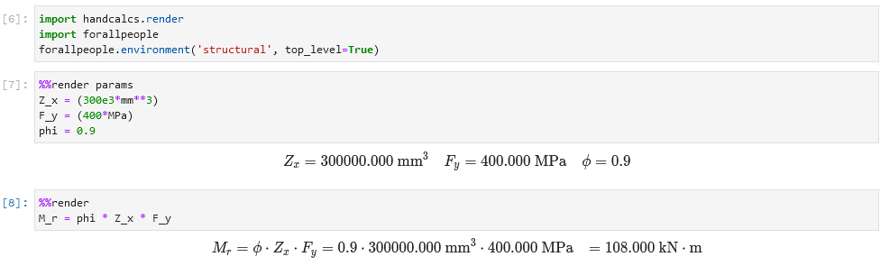

**For potential compatibility with other units packages, please see [the wiki.](https://github.com/connorferster/handcalcs/wiki)**

---

## Features

### Quickly display the values of many variables
No more `print` statements needed. Just plop your variables onto a line and they will all be displayed.

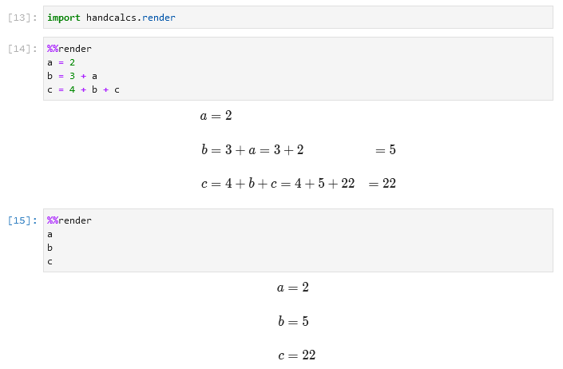

### Get Just the Latex Code, without the render
If you just want to generate the rendered Latex code directly to use in your own Latex files, you can use the `%%tex` cell magic instead:

```python
%%tex
a = 2
b = 3
c = 2*a + b/3
```

Then you can just copy and paste the result into your own LaTeX document.

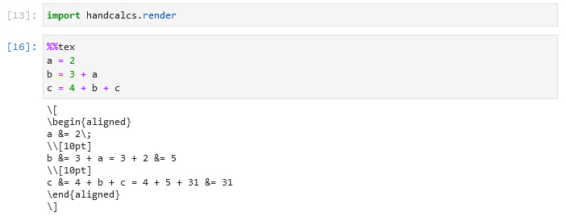

---

### Subscripts (and sub-subscripts, etc.)

Subscripts in variable names are automatically created when `_` is used in the variable name. Sub-subscripts are nested for each separate `_` used in series.

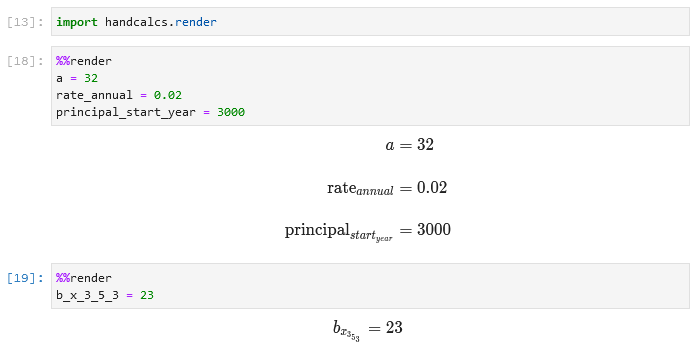


----

### Greek symbols

Any variable name that contains a Greek letter (e.g. "pi", "upsilon", "eta", etc.) as a string or substring will be replaced by the appropriate Latex code to represent that Greek letter.

| symbol | substitution | symbol | substitution |
|--------|--------------|--------|--------------|
| `alpha` |         α     | `Alpha` |       Α       |
| `beta`  |        β      | `Beta` |        Β       |
| `gamma` |        γ     | `Gamma` |        Γ      |
| `delta` |       δ      | `Delta` |        Δ      |
| `epsilon` |    ε       | `Epsilon` |      Ε      |
| `zeta`  |     ζ        | `Zeta`  |        Ζ      |
| `eta`  |       η       | `Eta`  |          Η     |
| `theta`|       θ       | `Theta` |         Θ     |
| `iota` |       ι       | `Iota` |         Ι      |
| `kappa` |      κ       | `Kappa` |         Κ     |
| `lamb`  |     λ        | `Lamb` |          Λ     |
| `mu`    |     μ        | `Mu` |           Μ      |
| `nu`    |      ν       | `Nu` |           N      |
| `xi`    |      ξ       | `Xi` |            Ξ     |
| `omicron` |    ο       | `Omicron` |       Ο     |
| `pi`    |      π       | `Pi` |            Π     |
| `rho`  |       ρ       | `Rho` |           Ρ     |
| `sigma` |      σ       | `Sigma` |         Σ     |
| `tau`   |      τ       | `Tau`  |          Τ     |
| `upsilon` |    υ       | `Upsilon` |       Υ     |
| `phi`    |     φ       | `Phi`  |          Φ     |
| `chi`    |     χ       | `Chi`   |         Χ     |
| `psi`   |      ψ       | `Psi`   |         Ψ     |
| `omega` |      ω       | `Omega` |         Ω     |  

* Using lower case letters as your variable name will make a lower case Greek letter.

* Using a Capitalized Name for your variable will render it as an upper case Greek letter.

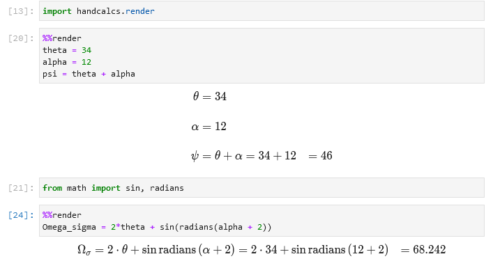

---

### Functions, built-in or custom

If you are using Python functions in your calculation, eg. `min()` or `tan()`, they will be replaced with Latex code to represent that function in Latex.

If you are creating your own functions, then they will be rendered in Latex as a custom operator.

If you are using a function with the name `sqrt` (whether your own custom implementation or from `math.sqrt`), then it will be rendered as the radical sign.

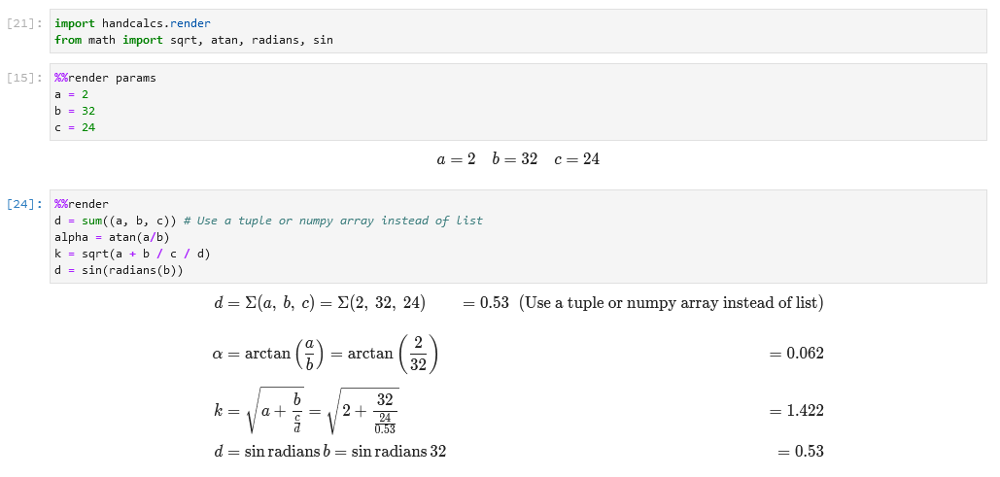

---

### Rendered in-line Comments

Any comments placed after a line of calculation will be rendered as an inline comment in the Latex. 

This makes it convenient to make notes along side your calculations to briefly explain where you may have acquired or derived a particular value.

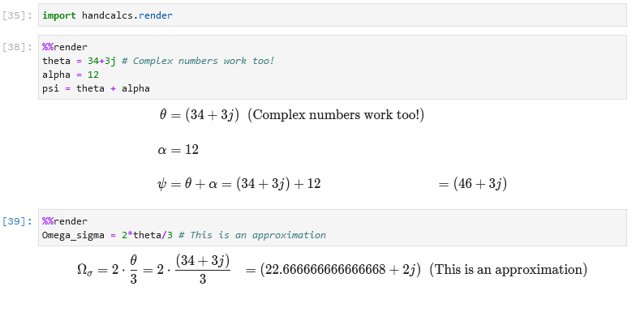

---

### Skip the substitution

Any calculation entirely wrapped in parentheses, `()`, will be rendered as just `param = result`, without the substitution. 

This can be convient when you want to calculate a parameter on the fly and not have it be the focus of the calculation.

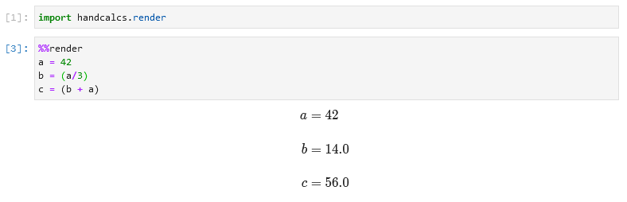

---

### Conditional statements

Many calculations in the "real world" are dependent on context.

`handcalcs` allows for the inclusion of some simple conditional statements into its code in a way that makes it easier to understand the context of the calculation.

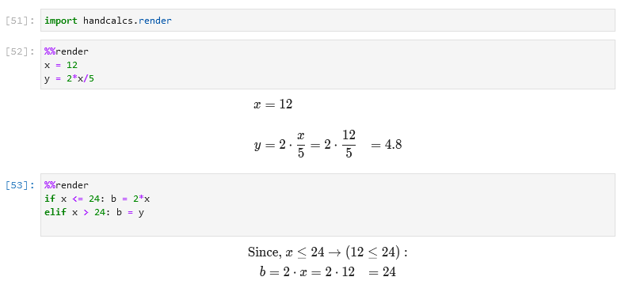

*Note: Multiple "lines" of calculations can be used after the conditional expression provided that they are all on the same line and separated with "`;`". See [Expected Behaviours](https://github.com/connorferster/handcalcs#expected-behaviours) for more context.*

---

### Numeric integration

You can use `scipy.quad` to perform numeric integration on a pre-defined function and have `handcalcs` perform a basic rendering of it.

This behaviour is triggered if you use a function with either `integrate` or `quad` in the name.

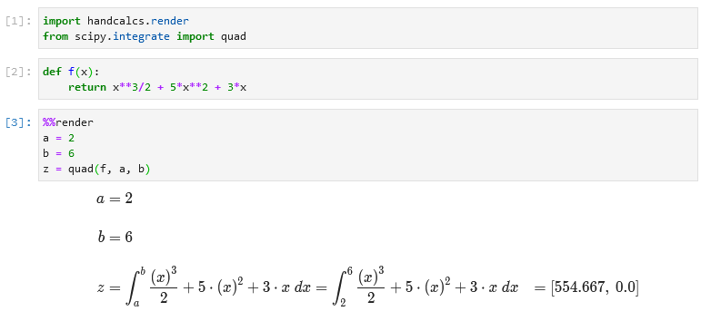

---

### "Prime" notation

Sometimes you need to write "prime" on your variables:

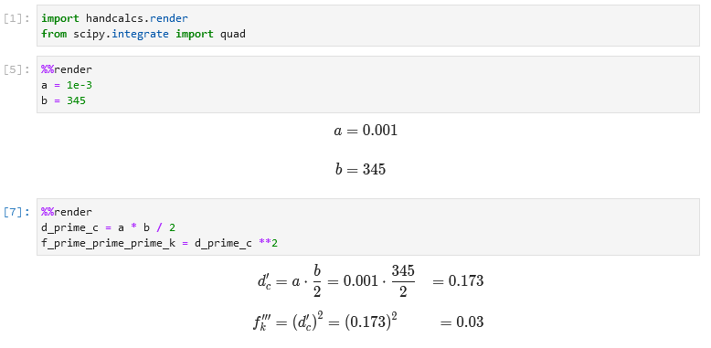

---

## PDF Printing in Jupyter

_Note:_ With `nbconvert` v6.0, installing templates (as shown in older YouTube videos) is no longer required. An `Exporter` for Jupyter Notebook/Lab is
installed when `handcalcs` is installed which gives you access to two new File -> Save and Export as options: 
1. Export `HTML_NoInput`
2. Export `LaTeX_NoInput`
3. Export `PDF_NoInput`

These options suppress all input cells so you only see rendered outputs in your Jupyter notebooks.

By using these three options, you can create PDF exports either by HTML (and then PDF print from your browser) or via LaTex (whether directly or through
your own LaTeX environment).

---

##  Expected Behaviours

`handcalcs` is intended to render arithmetical calculations written in Python code. It is not intended to render arbitrary Python into Latex. 

Given that, handcalcs only renders a small subset of Python and there is a lot that will not work, especially anything that happens over multiple lines (e.g. function definitions, `for` loops, `with` statements, etc.).

`handcalcs` works by parsing individual _lines_ of Python within a cell. It does not parse the cell as a whole. Therefore all statements to be rendered must be contained on a single line.

### Accepted datatypes

`handcalcs` will make an attempt to render all datatypes. However, it cannot yet render all "collection" based data types, e.g. `list` and `dict`. If you are using a collection to hold argument functions, e.g. `sum((23, 123, 45))`, use a `tuple` to ensure it is rendered properly. Alternatively, you can use one-dimensional `numpy` arrays (vectors) with handcalcs.

Objects are rendered into Latex by two main approaches:

1. If the object has a `_repr_latex_()` method defined, then that method is used.

    a) If the object has some alternate method for rendering itself into Latex code, e.g. `.latex()` or `.to_latex()`, that will be attempted as well.
    
    In order for the representation to be rendered properly, the object's Latex represention must use commands that are implemented with MathJax and/or Katex.
2. If the object does not have a Latex method, then `str()` is used.

If you are using object types which have str methods that render as `<MyObject: value=34>`, then that's what the Latex interpreter will see and attempt to render.

### Arithmetic operators

* `+` renders as `+`
* `-` renders as `-`
* `*` renders as the "dot operator" (Latex: \cdot)
* `/` always renders as a fraction
* `**` renders as superscripts
* `%` renders as the "mod function" (Latex: \mod)

Currently `//` is not rendered but you can easily use `math.floor` as a function instead (as `floor`).


### `for` loops and other iterations

Showing rendered iterations is not supported. The intention for use is that you perform your iterations in a cell that is not rendered and then, once the iteration has produced the desired resulting value, you render the result in a separate cell.

## Gotchas

Because `handcalcs` is designed for use within the Jupyter environment, and because Jupyter cells can be run out of order, there exists the possibility of having a big mess of beautifully rendered but **completely incorrect** calculations if you _re-use variable names throughout your notebook_.

`handcalcs` uses the notebook's user namespace dictionary to look up values for all variables in the namespace. If your calculations are re-using variable names throughout the notebook, then the dictionary entry for that name may not be what you think it is when you run cells out of the order originally intended.

You _can_ re-use variable names to good effect throughout a notebook, _IFF_ the cells are run in the correct order (easier if this is just top to bottom). 

**On this note: if you are using `handcalcs` for any kind of reporting that may become a legal document (e.g. design engineering calculations), it is up to YOU to ensure that the results are what you expect them to be. `handcalcs` is free and open-source software and the author(s) are not responsible for incorrect calculations that result from its use.**

That being said, the very purpose for the way `handcalcs` renders its math is to make it very easy to confirm and verify calculations by hand.

## YouTube Tutorials

**Getting Started with handcalcs (assumes zero Python knowledge)**

[https://www.youtube.com/watch?v=ZNFhLCWqA_g](https://www.youtube.com/watch?v=ZNFhLCWqA_g)

**Engineering Calculations: handcalcs-on-Jupyter vs. Excel**

[https://www.youtube.com/watch?v=n9Uzy3Eb-XI](https://www.youtube.com/watch?v=n9Uzy3Eb-XI)

## Applications and Compatibility with OPP (Other People's Packages)

** Please see [the wiki](https://github.com/connorferster/handcalcs/wiki) for applications of `handcalcs` in education and engineering, in addition to examples of using `handcalcs` with other Python libraries such [streamlit](https://github.com/connorferster/handcalcs/wiki/Handcalcs-on--Streamlit) and [papermill](https://github.com/connorferster/handcalcs/wiki/Handcalcs-on-Papermill).
